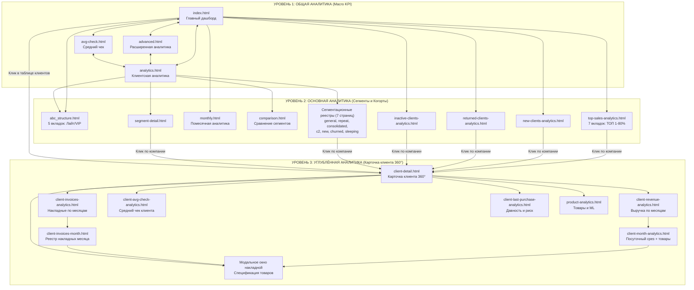

# 📊 ОТЧЁТ: Структура сайта UTSK Intelligent Sales
**Дата:** 07 сентября 2026 г.  
**Проект:** UTSK Intelligent Sales  
**Статус:** Завершён (Полный аудит структуры фронтенда, бэкенда и взаимосвязей страниц)

---

## 1. ОБЩАЯ ИНФОРМАЦИЯ

Настоящий отчёт содержит полную архитектурную карту веб-платформы **UTSK Intelligent Sales**, систематизированную по трём функциональным уровням бизнес-аналитики.

- **Всего страниц фронтенда (`static/*.html`):** `30`
- **Всего зарегистрированных маршрутов страниц (FastAPI HTML):** `30`
- **Всего REST API эндпоинтов бэкенда (`/api/...`):** `83`
- **Всего модульных роутеров FastAPI:** `10` (`pages`, `dashboard`, `clients`, `products`, `analytics`, `new_clients`, `returned_clients`, `inactive_clients`, `top_sales`, `client_analytics`)
- **Всего системных маршрутов (FastAPI Docs, OpenAPI, Health):** `6`
- **Общий пул маршрутов FastAPI:** `119`
- **Уровней бизнес-аналитики:** `3` (+ сервисно-справочный уровень)

### 1.1. Сводная таблица распределения страниц по уровням

| Уровень | Название уровня | Назначение и охват | Кол-во страниц | Ключевые страницы |
|:---|:---|:---|:---:|:---|
| **Уровень 1** | **Общая аналитика** *(Macro / Executive)* | Экспресс-обзор компании за 30 секунд: ключевые KPI, сводные воронки, годовой тренд, риск оттока | **4** | `index.html`, `analytics.html`, `advanced.html`, `avg-check.html` |
| **Уровень 2** | **Основная аналитика** *(Meso / Core)* | Сегментационный анализ, структура ABC-ядра, когортная динамика (новые, вернувшиеся, неактивные), сравнения периодов | **15** | `abc_structure.html`, `top-sales-analytics.html`, `monthly.html`, `comparison.html`, 7 реестров сегментации |
| **Уровень 3** | **Углублённая аналитика** *(Micro / Client 360°)* | Исчерпывающая детализация по конкретной компании: карточка 360°, накладные, средний чек, ML-рекомендации, посуточный разрез месяца | **8** | `client-detail.html`, `client-revenue-analytics.html`, `client-invoices-analytics.html`, `client-month-analytics.html`, `product-analytics.html` и др. |
| **Служебный** | **Справочники и статус** *(System / Docs)* | Документация схемы БД v7.1, дорожная карта проекта и страницы-заглушки | **3** | `db_reference.html`, `plan.html`, `product-recommendations.html` |
| **ИТОГО** | **Весь проект** | **Полный охват веб-приложения** | **30** | — |

---

## 2. УРОВЕНЬ 1: ОБЩАЯ АНАЛИТИКА (MACRO / EXECUTIVE)

### 2.1. Цель и бизнес-назначение уровня
Обеспечить руководителям высшего звена (генеральный директор, коммерческий директор, РОП) мгновенный срез состояния бизнеса:
- Текущие темпы выполнения годового плана по выручке и среднему чеку;
- Доля активной клиентской базы и распределение клиентов по воронке частоты сделок;
- Экспресс-выявление аномалий и рисков оттока (Churn Risk);
- Точки перехода на специализированные дашборды уровня 2 и карточки клиентов уровня 3.

### 2.2. Страницы Уровня 1

#### 1. `index.html` — Главный дашборд компании (UTSK Studio / Monitoring Hub)
- **URL-маршрут:** `/` (или `/index.html`)
- **Размер файла:** `83.5 KB`
- **Заголовок:** *UTSK Intelligent Sales — Аналитика*
- **Функциональный состав:**
  - Сайдбар с разделами: *Мониторинг* (Дашборд, Активные клиенты, Воронка), *AI Аналитика* (Рекомендации, Риск оттока), *Инструменты* (ТОП продаж, Новые, Вернувшиеся, Неактивные, Расширенная аналитика, Аналитика ABC);
  - Интерактивный поиск по клиентам с подсказками;
  - 4 главные KPI-карточки со сквозными переходами:
    - *Активных клиентов* ➔ переход на `/analytics`
    - *Покупок за 30 дней* ➔ переход на `/monthly`
    - *Выручка 2026* ➔ переход на `/advanced`
    - *Средний чек* ➔ переход на `/avg-check`
  - Интерактивные вкладки: таблица активных клиентов с пагинацией и поиском, визуализатор воронки, матрица ML-рекомендаций, когорта риска оттока.
- **Вызываемые API (`9`):**
  - `/api/dashboard`
  - `/api/clients`
  - `/api/clients/active`
  - `/api/clients/top-sales`
  - `/api/clients/churn-risk`
  - `/api/funnel`
  - `/api/recommendations/${clientCode}`
  - `/api/analytics/monthly-revenue`
  - `/api/analytics/yearly-clients-count`
- **Связи страницы:**
  - *Входящие переходы:* из 12 страниц проекта (кнопки «← На дашборд»);
  - *Исходящие переходы:* `analytics.html`, `monthly.html`, `advanced.html`, `avg-check.html`, `comparison.html`, `top-sales-analytics.html`, `new-clients-analytics.html`, `returned-clients-analytics.html`, `inactive-clients-analytics.html`, `abc_structure.html`, `client-detail.html`.

#### 2. `analytics.html` — Центральная витрина аналитики клиентской базы
- **URL-маршрут:** `/analytics`
- **Размер файла:** `216.5 KB` (крупнейший аналитический модуль системы)
- **Заголовок:** *UTSK — Аналитика по клиентам*
- **Функциональный состав:**
  - Фильтры глобального среза: Выбор года (2026/2025/2024), Коэффициент мультипликатора ABC (по умолчанию 2.9), Граница отсечения мелких клиентов C2 (146 000 ₴);
  - Верхний баннер макро-KPI: Выручка, Активные компании, Средний чек, Рост YoY;
  - 6 аналитических вкладок:
    1. `tab-segmentation` — **Загальна сегментація** (Таблиця 1: декомпозиция частоты покупок, повторные сделки, консолидированный слой);
    2. `tab-abc-structure` — **ABC-структура** (интеграция структурного анализа сегментов);
    3. `tab-yoy` — **YoY сравнение** (помесячное сопоставление 2026 vs 2025);
    4. `tab-abc` — **АВС сегментация** (матрица групп A, B, C с настраиваемыми границами);
    5. `tab-recurrent` — **Повторные покупки** (динамика удержания);
    6. `tab-clients-yoy` — **YoY-анализ клиентов** (годовые когорты);
  - Сквозные интерактивные кнопки быстрого перехода в детальные реестры компаний.
- **Вызываемые API (`9`):**
  - `/api/analytics/segmentation-current-year`
  - `/api/analytics/segmentation-past-years`
  - `/api/analytics/abc-groups`
  - `/api/analytics/yoy-comparison`
  - `/api/analytics/recurrent-clients`
  - `/api/analytics/clients-yoy`
  - `/api/analytics/monthly-revenue`
  - `/api/analytics/yearly-clients-count`
  - `/api/analytics/pivot-formatted`
- **Связи страницы:**
  - *Входящие переходы:* `index.html`, `advanced.html`, `avg-check.html`, `comparison.html` и все сегментационные страницы;
  - *Исходящие переходы:* `general-segmentation.html`, `repeat-segmentation.html`, `consolidated-segmentation.html`, `c2-segmentation.html`, `new-clients-segmentation.html`, `churned-segmentation.html`, `sleeping-segmentation.html`, `segment-detail.html`, `index.html`.

#### 3. `advanced.html` — Расширенная аналитика и макро-тренды
- **URL-маршрут:** `/advanced`
- **Размер файла:** `36.2 KB`
- **Заголовок:** *UTSK Intelligent Sales — Расширенная Аналитика*
- **Функциональный состав:**
  - 4 аналитические вкладки:
    1. *Главный Дашборд* (KPI сетка, график помесячной выручки, воронка частоты покупок);
    2. *Сравнение YoY* (график 2026 vs 2025, таблица ежемесячной динамики с темпами прироста);
    3. *Сегментация* (сводная структура клиентской базы);
    4. *Продукция* (макро-распределение объемов по товарным группам);
  - Быстрый переход к детальному сравнению сегментов.
- **Вызываемые API (`4`):**
  - `/api/analytics/monthly-revenue`
  - `/api/analytics/segment-comparison`
  - `/api/analytics/yearly-clients-count`
  - `/api/funnel`
- **Связи страницы:**
  - *Входящие переходы:* `index.html`, `avg-check.html`;
  - *Исходящие переходы:* `index.html`, `comparison.html`, `analytics.html`.

#### 4. `avg-check.html` — Макро-аналитика среднего чека
- **URL-маршрут:** `/avg-check`
- **Размер файла:** `29.2 KB`
- **Заголовок:** *UTSK Intelligent Sales — Аналитика Среднего Чека*
- **Функциональный состав:**
  - 3 вкладки макро-анализа чека:
    1. *Общий срез* (Общий средний чек, Чек без сопутствующих услуг, Чек ABC-ядра, Чек случайных разовых сделок);
    2. *Влияние ML и Услуг* (оценка прироста чека от кросс-продаж и сервисов порезки/доставки);
    3. *Сегментация по ABC* (сравнение среднего чека между категориями A, B, C);
  - График динамики чека и инсайты по факторам роста.
- **Вызываемые API (`3`):**
  - `/api/analytics/monthly-revenue`
  - `/api/analytics/segment-comparison`
  - `/api/analytics/yearly-clients-count`
- **Связи страницы:**
  - *Входящие переходы:* `index.html`, `client-avg-check-analytics.html`;
  - *Исходящие переходы:* `index.html`, `advanced.html`, `analytics.html`.

### 2.3. Связи и переходы Уровня 1

```
                  ┌─────────────────────────────────────┐
                  │             index.html              │
                  │       (Главный Дашборд Hub)         │
                  └───┬─────────────┬─────────────┬─────┘
                      │             │             │
        ┌─────────────┘             │             └─────────────┐
        ▼                           ▼                           ▼
┌──────────────┐            ┌──────────────┐            ┌──────────────┐
│  analytics   │◄───────────┤   advanced   │───────────►│  avg-check   │
│ (Клиентский) │            │ (YoY / План) │            │ (Чек / Тренды│
└───────┬──────┘            └───────┬──────┘            └───────┬──────┘
        │                           │                           │
        └───────────────────────────┴───────────────────────────┘
                                    │
                                    ▼ (Выход на Уровень 2)
```

---

## 3. УРОВЕНЬ 2: ОСНОВНАЯ АНАЛИТИКА (MESO / CORE)

### 3.1. Цель и бизнес-назначение уровня
Предоставить руководителям отделов продаж и старшим аналитикам инструменты глубокой сегментации, когортного анализа и контроля ключевых клиентских групп:
- Декомпозиция клиентской базы по частоте покупок (1 раз, 2-3 раза, системные);
- Анализ ядра продаж (ABC-структура и визуализация ТОП-клиентов, формирующих 80% оборота);
- Мониторинг жизненного цикла: привлечение (новые), реактивация (вернувшиеся), удержание (повторные) и отток (спящие, ушедшие);
- Полные реестры компаний с фильтрами для перехода в карточку конкретного клиента (Уровень 3).

### 3.2. Страницы Уровня 2 (15 страниц)

#### Блок А. Структурный и когортный анализ выручки
1. **`abc_structure.html` — Структурный ABC-анализ (5 Вкладок)**
   - **Маршрут:** `/abc-structure` | **Размер:** `49.8 KB`
   - **Вкладки:**
     - `tab-overview` — *Загальна структура* (сопоставление 4-х секций, распределение по частоте);
     - `tab-c2` — *💡 Лайт* (мелкие клиенты с оборотом < 146 тыс. ₴);
     - `tab-abc` — *💎 Преміум* (ABC-ядро с оборотом от 146 тыс. ₴);
     - `tab-total` — *📊 Всі* (консолидированная картина 100% клиентской базы);
     - `tab-important` — *⭐ VIP* (критические клиенты максимальной важности).
   - **API:** `/api/analytics/abc-structure`, `/api/analytics/abc-segment-detail`.
   - **Связи:** переходы на `analytics.html`.

2. **`top-sales-analytics.html` — Визуализация ТОП продаж (7 Вкладок)**
   - **Маршрут:** `/top-sales-analytics` | **Размер:** `73.6 KB`
   - **Вкладки:**
     - 🥇 *ТОП-1* (моно-анализ лидера выручки, динамика YoY, ТОП-5 его товаров);
     - 🥈 *ТОП-5* (совокупная доля, ключевые позиции);
     - 🥉 *ТОП-10* (ядро первого эшелона);
     - 📊 *ТОП-25* (основные генераторы оборота);
     - 📈 *ТОП-50%* (компании, формирующие половину выручки компании);
     - 📋 *ТОП-70%* (граница категории A/B);
     - 📊 *ТОП-80%* (классическое Парето-ядро бизнеса).
   - **API:** `/api/analytics/top-sales/overview`, `/api/analytics/top-sales/kpi`, `/api/analytics/top-sales/companies`, `/api/analytics/top-sales/company-detail`, `/api/analytics/top-sales/core`, `/api/analytics/top-sales/compare-yoy`.
   - **Связи:** клик по любой строке или карточке компании ➔ `/client-detail?code=...`.

3. **`monthly.html` — Помесячная аналитика компании**
   - **Маршрут:** `/monthly` | **Размер:** `31.4 KB`
   - **Вкладки:**
     - 📈 *По дням* (календарный график ежедневных отгрузок);
     - 📊 *Сравнение* (план/факт и YoY выбранного месяца);
     - 🔄 *Миграция ABC* (переход клиентов между категориями);
     - 🆕 *Залётные* (клиенты с разовой нетипичной закупкой);
     - 🏗️ *Отрасли и Товары* (структура спроса по направлениям металлопроката);
     - 👥 *Топ-10* (лидеры месяца по закупкам).
   - **API:** `/api/analytics/daily-revenue`, `/api/analytics/monthly-detail`, `/api/analytics/abc-migration`, `/api/analytics/zaletnye`, `/api/analytics/monthly-directions`, `/api/analytics/monthly-products`, `/api/analytics/monthly-top-clients`.
   - **Связи:** выход на `index.html` и `analytics.html`.

4. **`comparison.html` — Сравнительный анализ сегментов**
   - **Маршрут:** `/comparison` | **Размер:** `47.4 KB`
   - **Назначение:** Матричный компаратор периодов (2026 vs 2025 vs 2024) в разрезе частотных сегментов: динамика выручки, накладных, активной базы, расчет удельного чека на компанию.
   - **API:** `/api/analytics/segment-comparison`.
   - **Связи:** переходы на `index.html` и `analytics.html`.

#### Блок Б. Жизненный цикл и статусная динамика клиентов
5. **`new-clients-analytics.html` — Аналитика новых клиентов (5 Вкладок)**
   - **Маршрут:** `/new-clients-analytics` | **Размер:** `37.9 KB`
   - **Вкладки:** *Частота покупок*, *ABC-анализ Новых*, *Сравнение Новых vs Все*, *Список клиентов* (интерактивный реестр с переходом в карточку), *Сводка*.
   - **API:** `/api/analytics/new-clients-overview`, `/api/analytics/new-clients-frequency`, `/api/analytics/new-clients-abc`, `/api/analytics/new-clients-abc-compare`, `/api/analytics/new-clients-list`.
   - **Связи:** строки таблицы ➔ `/client-detail?code=...`.

6. **`returned-clients-analytics.html` — Аналитика вернувшихся клиентов (5 Вкладок)**
   - **Маршрут:** `/returned-clients-analytics` | **Размер:** `40.2 KB`
   - **Вкладки:** *Распределение по частоте*, *ABC-анализ*, *Сравнение с Новыми*, *Список компаний*, *KPI динамика*.
   - **API:** `/api/analytics/returned-clients-overview`, `/api/analytics/returned-clients-frequency`, `/api/analytics/returned-clients-abc`, `/api/analytics/returned-clients-compare-new`, `/api/analytics/returned-clients-list`.
   - **Связи:** строки таблицы ➔ `/client-detail?code=...`.

7. **`inactive-clients-analytics.html` — Аналитика неактивных клиентов (4 Вкладки)**
   - **Маршрут:** `/inactive-clients-analytics` | **Размер:** `40.2 KB`
   - **Вкладки:** *Спящие vs Ушедшие*, *Распределение по сроку неактивности*, *ABC-ранг потерь*, *Список компаний для реактивации*.
   - **API:** `/api/analytics/inactive-clients-overview`, `/api/analytics/inactive-clients-distribution`, `/api/analytics/inactive-clients-abc`, `/api/analytics/inactive-clients-list`.
   - **Связи:** строки таблицы ➔ `/client-detail?code=...`.

#### Блок В. Сегментационные реестры клиентской базы
8. **`general-segmentation.html` — Загальна сегментація клієнтської бази**
   - **Маршрут:** `/general-segmentation` | **Размер:** `52.9 KB`
   - **Назначение:** Полный реестр компаний с фильтрами по частоте (разовые, 2 раза, 3..10+ покупок).
   - **API:** `/api/analytics/general-segmentation-companies`. Клик по строке ➔ `/client-detail`.

9. **`repeat-segmentation.html` — Повторні (розкладені) деталізація**
   - **Маршрут:** `/repeat-segmentation` | **Размер:** `49.1 KB`
   - **Назначение:** Реестр компаний с повторными покупками (174 компании ядра повторных сделок).
   - **API:** `/api/analytics/repeat-segmentation-companies`. Клик по строке ➔ `/client-detail`.

10. **`consolidated-segmentation.html` — Всі (консолідовано) реєстр компаній**
    - **Маршрут:** `/consolidated-segmentation` | **Размер:** `48.6 KB`
    - **Назначение:** Консолидированная таблица всей базы клиентов с агрегированными показателями.
    - **API:** `/api/analytics/consolidated-segmentation-companies`. Клик по строке ➔ `/client-detail`.

11. **`c2-segmentation.html` — Лайт (Дрібні клієнти)**
    - **Маршрут:** `/c2-segmentation` | **Размер:** `47.3 KB`
    - **Назначение:** Реестр мелких покупателей (выручка < 146 тыс. ₴) для оценки потенциала доращивания.
    - **API:** `/api/analytics/c2-segmentation-companies`. Клик по строке ➔ `/client-detail`.

12. **`new-clients-segmentation.html` — Нові клієнти: Сегментація за частотою**
    - **Маршрут:** `/new-clients-segmentation` | **Размер:** `51.1 KB`
    - **Назначение:** Специализированный реестр 152 новых клиентов с распределением по частоте.
    - **API:** `/api/analytics/new-clients-segmentation-companies`. Клик по строке ➔ `/client-detail`.

13. **`churned-segmentation.html` — Вибули (Ушедшие) клієнти**
    - **Маршрут:** `/churned-segmentation` | **Размер:** `46.4 KB`
    - **Назначение:** Реестр клиентов в оттоке (не покупали более 12 месяцев) с оценкой исторической ценности.
    - **API:** `/api/analytics/churned-segmentation-companies`. Клик по строке ➔ `/client-detail`.

14. **`sleeping-segmentation.html` — Сплячі клієнти (Аналіз бази)**
    - **Маршрут:** `/sleeping-segmentation` | **Размер:** `47.9 KB`
    - **Назначение:** Реестр спящих клиентов (88 компаний без покупок 3–12 месяцев) для запуска кампаний реактивации.
    - **API:** `/api/analytics/sleeping-segmentation-companies`. Клик по строке ➔ `/client-detail`.

15. **`segment-detail.html` — Универсальная детализация сегмента**
    - **Маршрут:** `/segment-detail` | **Размер:** `24.0 KB`
    - **Назначение:** Параметрический реестр для просмотра любого сегмента матрицы ABC/RFM по URL-параметрам.
    - **API:** `/api/analytics/segment-detail`. Клик по строке ➔ `/client-detail`.

### 3.3. Связи и переходы Уровня 2

```
                       ┌─────────────────────────┐
                       │     analytics.html      │
                       └────────────┬────────────┘
                                    │
    ┌───────────────────────────────┼───────────────────────────────┐
    │                               │                               │
    ▼                               ▼                               ▼
┌───────────────────────┐  ┌───────────────────────┐  ┌───────────────────────┐
│  abc_structure.html   │  │ top-sales-analytics   │  │     monthly.html      │
│ (5 Вкладок: Лайт/VIP) │  │  (7 Вкладок: ТОП 1-80)│  │ (Календарь/Залётные)  │
└───────────┬───────────┘  └───────────┬───────────┘  └───────────┬───────────┘
            │                          │                          │
            ▼                          ▼                          ▼
┌─────────────────────────────────────────────────────────────────────────────┐
│                       Когортные и реестровые страницы:                       │
│ ├─ new-clients-analytics.html / new-clients-segmentation.html               │
│ ├─ returned-clients-analytics.html                                          │
│ ├─ inactive-clients-analytics.html / sleeping / churned                     │
│ └─ general-segmentation / repeat / consolidated / c2-segmentation           │
└──────────────────────────────────────┬──────────────────────────────────────┘
                                       │
                                       ▼ (Выход на Уровень 3: клик по клиенту)
                                client-detail.html
```

---

## 4. УРОВЕНЬ 3: УГЛУБЛЁННАЯ АНАЛИТИКА (MICRO / CLIENT 360°)

### 4.1. Цель и бизнес-назначение уровня
Инструментарий менеджера по продажам и клиентского аналитика для подготовки к переговорам, допродаж и контроля сервиса:
- Профиль клиента 360° со всеми статусами за 2025 и 2026 годы;
- Детальный помесячный разбор выручки, накладных и динамики среднего чека;
- Посуточный календарь активности и товарный состав каждой накладной;
- ML-рекомендации сопутствующих товаров металлопроката с учётом складских остатков.

### 4.2. Страницы Уровня 3 (8 страниц)

#### 1. `client-detail.html` — Карточка клиента 360° (Главный хаб Уровня 3)
- **Маршрут:** `/client-detail?code={CLIENT_CODE}` | **Размер:** `41.0 KB`
- **Заголовок:** *UTSK — Детализация клиента*
- **Ключевые элементы:**
  - Шапка: наименование компании, код, статусные бейджи 2025/2026 (Зелёный/Синий/Оранжевый);
  - **4 интерактивные KPI-карточки со сквозным переходом в специализированную микро-аналитику:**
    - `kpi-link-revenue` ➔ `/client-revenue-analytics?code={CODE}`
    - `kpi-link-invoices` ➔ `/client-invoices-analytics?code={CODE}`
    - `kpi-link-avg-check` ➔ `/client-avg-check-analytics?code={CODE}`
    - `kpi-link-last-purchase` ➔ `/client-last-purchase-analytics?code={CODE}`
  - График помесячной динамики продаж: 2026 vs 2025;
  - Блок ML-рекомендаций с кликабельным переходом на `/product-analytics`;
  - Интерактивная таблица накладных с фильтрацией по году, месяцу и датам;
  - **Встроенное модальное окно детализации накладной:** просмотр спецификации накладной (код товара, наименование, количество, вес в кг, цена, сумма, итоговые метрики).
- **Вызываемые API (`4`):**
  - `/api/clients/detail/{code}`
  - `/api/clients/invoices/{code}`
  - `/api/invoices/{number}/items`
  - `/api/recommendations/{code}`
- **Связи страницы:**
  - *Входящие переходы:* из всех 15 страниц Уровня 2 и главного дашборда `index.html`;
  - *Исходящие переходы:* `client-revenue-analytics.html`, `client-invoices-analytics.html`, `client-avg-check-analytics.html`, `client-last-purchase-analytics.html`, `product-analytics.html`, `index.html`.

#### 2. `client-revenue-analytics.html` — Помесячный анализ выручки клиента
- **Маршрут:** `/client-revenue-analytics?code={CODE}` | **Размер:** `19.6 KB`
- **Заголовок:** *💰 UTSK — Анализ выручки клиента*
- **Функционал:** Помесячное сопоставление выручки 2026 vs 2025, расчет темпов роста MoM и YoY, кумулятивная выручка нарастающим итогом.
- **Действие:** Клик по строке конкретного месяца ➔ переход в посуточный разрез месяца (`client-month-analytics.html`).
- **API:** `/api/analytics/client/revenue`.

#### 3. `client-invoices-analytics.html` — Анализ накладных клиента
- **Маршрут:** `/client-invoices-analytics?code={CODE}` | **Размер:** `24.3 KB`
- **Заголовок:** *📄 UTSK — Анализ накладных клиента*
- **Функционал:** Помесячная динамика количества накладных, количества отгруженных позиций и среднего числа строк в заказе.
- **Действие:** Клик по месяцу ➔ переход в реестр накладных за месяц (`client-invoices-month.html`).
- **API:** `/api/analytics/client/invoices`.

#### 4. `client-invoices-month.html` — Накладные клиента за конкретный месяц
- **Маршрут:** `/client-invoices-month?code={CODE}&year={Y}&month={M}` | **Размер:** `16.0 KB`
- **Заголовок:** *📄 UTSK — Накладные клиента за месяц*
- **Функционал:** Список всех расходных накладных компании за выбранный календарный месяц с суммами и позициями. Вызов модального окна состава товаров.
- **API:** `/api/analytics/client/invoices-month`, `/api/invoices/{number}/items`.

#### 5. `client-avg-check-analytics.html` — Анализ среднего чека клиента
- **Маршрут:** `/client-avg-check-analytics?code={CODE}` | **Размер:** `18.6 KB`
- **Заголовок:** *🛒 UTSK — Анализ среднего чека клиента*
- **Функционал:** Помесячная динамика чека конкретного клиента в сопоставлении с общим средним чеком по компании и по его ABC-группе.
- **API:** `/api/analytics/client/avg-check`.

#### 6. `client-last-purchase-analytics.html` — Анализ последней покупки клиента
- **Маршрут:** `/client-last-purchase-analytics?code={CODE}` | **Размер:** `16.4 KB`
- **Заголовок:** *🕒 UTSK — Анализ последней покупки клиента*
- **Функционал:** Дней с последней отгрузки, скоринг риска оттока, сравнение текущего межзакупочного интервала со средним историческим циклом клиента.
- **API:** `/api/analytics/client/last-purchase`.

#### 7. `client-month-analytics.html` — Глубокий анализ месяца компании
- **Маршрут:** `/client-month-analytics?code={CODE}&year={Y}&month={M}` | **Размер:** `28.5 KB`
- **Заголовок:** *📅 UTSK — Анализ месяца компании*
- **Функционал:**
  - 4 подраздела:
    1. Посуточная динамика выручки в выбранном месяце;
    2. Полный перечень накладных месяца с кнопками открытия состава;
    3. Товарная матрица купленных в этом месяце товаров (вес, количество, сумма);
    4. Сводные KPI месяца (выручка, накладные, средний чек дня).
- **API (`5`):**
  - `/api/analytics/client/month-summary`
  - `/api/analytics/client/month-daily`
  - `/api/analytics/client/month-invoices`
  - `/api/analytics/client/month-products`
  - `/api/invoices/{number}/items`

#### 8. `product-analytics.html` — Аналитика продуктов клиента
- **Маршрут:** `/product-analytics?code={CODE}` | **Размер:** `28.7 KB`
- **Заголовок:** *UTSK — Аналитика продуктов клиента*
- **Вкладки:**
  - 📊 *Портфель продуктов* (структура покупок клиента по категориям металлопроката: трубы, арматура, балка, лист);
  - 🔄 *Динамика 2026 vs 2025* (выпадающие и растущие товарные позиции);
  - 🤖 *ML-Рекомендации* (персонализированные предложения допродажи с оценкой вероятности и складского остатка).
- **API (`3`):**
  - `/api/analytics/client-products/{code}`
  - `/api/analytics/client-products-compare/{code}`
  - `/api/analytics/client-products-recommendations/{code}`

### 4.3. Цепочки детализации Уровня 3 (Drilldown Paths)

```
                            ┌────────────────────────┐
                            │   client-detail.html   │
                            │  (Карточка клиента 360)│
                            └───────────┬────────────┘
                                        │
        ┌───────────────────┬───────────┴───────────┬───────────────────┐
        ▼                   ▼                       ▼                   ▼
┌───────────────┐   ┌───────────────┐       ┌───────────────┐   ┌───────────────┐
│client-revenue │   │client-invoices│       │client-avg-chk │   │product-analyt.│
│  -analytics   │   │  -analytics   │       │  -analytics   │   │(Товары + ML)  │
└───────┬───────┘   └───────┬───────┘       └───────────────┘   └───────────────┘
        │                   │
        ▼                   ▼
┌───────────────┐   ┌───────────────┐
│ client-month  │   │client-invoices│
│  -analytics   │   │    -month     │
│(Дни+Товары)   │   │(Реестр накл.) │
└───────┬───────┘   └───────┬───────┘
        │                   │
        └─────────┬─────────┘
                  ▼ (Модальное окно)
       Детализация накладной:
    спецификация товаров, вес, цена
```

---

## 5. СЛУЖЕБНЫЕ И СПРАВОЧНЫЕ СТРАНИЦЫ (SYSTEM & REFERENCE)

1. **`db_reference.html` — Интерактивный справочник по базе данных UTSK v7.1**
   - **Маршрут:** `/db-reference` | **Размер:** `131.2 KB`
   - **Назначение:** Исчерпывающая техническая документация архитектуры БД PostgreSQL (`bd_intelligent_sales`):
     - Описание 12 базовых таблиц (`clients`, `sales_lines`, `products`, `activity_directions` и др.);
     - 14 представлений (views) и аналитических витрин;
     - 88 процедур и SQL-функций расчета ABC, когорт и сегментации;
     - Триггеры версионирования и логирования статусов.
   - **Связи:** содержит ссылку «← На дашборд» (`/`).

2. **`plan.html` — План разработки UTSK Intelligent Sales v7.1**
   - **Маршрут:** `/plan` | **Размер:** `79.3 KB`
   - **Назначение:** Интерактивная дорожная карта (Roadmap) проекта, включающая архитектурные этапы, фазы внедрения ML, историю релизов и чеклисты тестирования.
   - **Связи:** содержит возврат на главный дашборд (`/`).

3. **`product-recommendations.html` — Заглушка рекомендаций по продукту**
   - **Маршрут:** `/product-recommendations` | **Размер:** `2.3 KB`
   - **Назначение:** Страница-заглушка ("Страница в разработке") для планировавшегося каталога рекомендаций.
   - **Текущий статус:** функционал полноценно реализован на странице `product-analytics.html` и в модальном окне `client-detail.html`. Рекомендуется к перенаправлению (301 Redirect).

---

## 6. СВЯЗИ МЕЖДУ СТРАНИЦАМИ И ГРАФ НАВИГАЦИИ

### 6.1. Матрица межуровневых переходов



### 6.2. Основные пользовательские сценарии (User Journeys)

#### Сценарий 1: Управление оттоком и спящей базой
1. **Уровень 1 (`index.html`):** Руководитель видит виджет «Риск оттока» или переходит в боковом меню в раздел «Неактивные клиенты».
2. **Уровень 2 (`inactive-clients-analytics.html`):** Анализируется когорта ушедших и спящих компаний, оценивается потерянная выручка в разрезе ABC-рангов.
3. **Уровень 2 ➔ Уровень 3:** Выбирается компания с высоким чеком; клик переводит в `client-detail.html`.
4. **Уровень 3 (`client-last-purchase-analytics.html`):** Менеджер видит точную дату последней сделки, дни простоя и заказывает список последних купленных позиций через `product-analytics.html` для звонка с персонализированным оффером.

#### Сценарий 2: Аудит ядра продаж (Парето 80/20)
1. **Уровень 1 (`index.html` / `analytics.html`):** Переход в визуализатор ТОП продаж.
2. **Уровень 2 (`top-sales-analytics.html`):** Переключение на вкладку `ТОП-80%`. Система выводит ключевой пул клиентов, формирующих 80% выручки компании.
3. **Уровень 2 ➔ Уровень 3:** Клик по компании открывает `client-detail.html`.
4. **Уровень 3 (`client-revenue-analytics.html` ➔ `client-month-analytics.html`):** Изучается помесячная стабильность отгрузок, выявляются месяцы просадки и вызывается детальный состав расходных накладных.

---

## 7. РЕКОМЕНДАЦИИ ПО РЕСТРУКТУРИЗАЦИИ И ОПТИМИЗАЦИИ

На основе проведенного анализа 30 страниц и 83 API сформулированы следующие рекомендации по улучшению архитектуры платформы:

### 7.1. Оптимизация Уровня 1: Разграничение зон ответственности
- **Проблема:** Страницы `index.html`, `advanced.html` и `analytics.html` частично дублируют карточки макро-показателей и графики помесячной выручки.
- **Решение:**
  1. Закрепить `index.html` как **Executive Dashboard** (фокус на ключевых индикаторах бизнеса, алертах и верхнеуровневой воронке для топ-менеджмента);
  2. Спозиционировать `analytics.html` как **Analytical Workspace** (рабочий стол бизнес-аналитика с настраиваемыми коэффициентами ABC и фильтрами);
  3. Модуль `advanced.html` объединить с `comparison.html` в единый аналитический блок сравнения периодов.

### 7.2. Консолидация Уровня 2: Объединение 7 сегментационных страниц
- **Проблема:** Страницы `general-segmentation.html`, `repeat-segmentation.html`, `consolidated-segmentation.html`, `c2-segmentation.html`, `new-clients-segmentation.html`, `churned-segmentation.html` и `sleeping-segmentation.html` имеют практически на 95% идентичный HTML-шаблон, CSS-стили, фильтрацию и JavaScript обработки таблиц.
- **Решение:**
  - Объединить их в единый мощный компонент `segmentation-registry.html?segment={type}`, где параметр `type` (`general`, `repeat`, `consolidated`, `c2`, `new`, `churned`, `sleeping`) определяет вызываемый API и заголовок;
  - **Эффект:** сокращение кодовой базы на ~320 КБ избыточного HTML/JS кода, исключение рассинхронизации верстки при внесении правок.

### 7.3. Реорганизация Уровня 3: Создание единого Client 360° SPA
- **Проблема:** Для анализа одного клиента в настоящее время используется цепочка из 7 раздельных HTML-файлов (`client-detail`, `client-revenue`, `client-invoices`, `client-invoices-month`, `client-avg-check`, `client-last-purchase`, `client-month`). Каждый переход перезагружает страницу целиком, сбрасывая состояние прокрутки и параметры токена.
- **Решение:**
  - Трансформировать `client-detail.html` в единый Client 360° интерфейс на вкладках или боковых панелях (Drawer / Offcanvas):
    - Вкладка 1: *Обзор и KPI*
    - Вкладка 2: *Динамика выручки и чека (YoY)*
    - Вкладка 3: *Накладные и товарные корзины*
    - Вкладка 4: *Товары и ML-рекомендации*
  - **Эффект:** скорость работы менеджера возрастет в 3–4 раза за счет мгновенного переключения между аспектами клиента без полной перезагрузки DOM.

### 7.4. Фронтенд-архитектура: Вынос общих CSS и JS модулей
- **Проблема:** Во всех 30 HTML-страницах стили CSS и JavaScript утилиты (форматирование валюты `formatCur`, чисел `formatNum`, авторизация по токену, навигационные панели) встроены инлайн.
- **Решение:**
  - Создать директорию `utsk_web/frontend/static/assets/`:
    - `css/theme.css` — единые переменные цветов, шрифтов, карточек и адаптивной сетки;
    - `js/api-client.js` — модуль инкапсуляции fetch-запросов и передачи токена;
    - `js/formatters.js` — стандартные утилиты форматирования;
    - `js/navbar.js` — единый генератор верхней панели и сайдбара.

### 7.5. Единая навигационная цепочка (Breadcrumbs)
- **Проблема:** На ряде страниц кнопка возврата ведет на `/`, на других — на `/analytics`, на третьих используется `history.back()`. При глубоких переходах пользователь теряет контекст.
- **Решение:** Внедрить сквозной хлебный компонент по стандарту 3-х уровней:
  `Дашборд (Ур. 1) › ТОП-продаж (Ур. 2) › Карточка клиента (Ур. 3) › Выручка 2026`

---

## 8. ИТОГОВЫЙ СПИСОК СТРАНИЦ ПРОЕКТА ПО УРОВНЯМ

```
UTSK Intelligent Sales Platform (30 страниц)
│
├── 🌐 УРОВЕНЬ 1: ОБЩАЯ АНАЛИТИКА (4 страницы)
│   ├── index.html                           [ / ]
│   ├── analytics.html                       [ /analytics ]
│   ├── advanced.html                        [ /advanced ]
│   └── avg-check.html                       [ /avg-check ]
│
├── 📊 УРОВЕНЬ 2: ОСНОВНАЯ АНАЛИТИКА (15 страниц)
│   ├── abc_structure.html                   [ /abc-structure ]
│   ├── top-sales-analytics.html             [ /top-sales-analytics ]
│   ├── monthly.html                         [ /monthly ]
│   ├── comparison.html                      [ /comparison ]
│   ├── new-clients-analytics.html           [ /new-clients-analytics ]
│   ├── returned-clients-analytics.html      [ /returned-clients-analytics ]
│   ├── inactive-clients-analytics.html      [ /inactive-clients-analytics ]
│   ├── general-segmentation.html            [ /general-segmentation ]
│   ├── repeat-segmentation.html             [ /repeat-segmentation ]
│   ├── consolidated-segmentation.html       [ /consolidated-segmentation ]
│   ├── c2-segmentation.html                 [ /c2-segmentation ]
│   ├── new-clients-segmentation.html        [ /new-clients-segmentation ]
│   ├── churned-segmentation.html            [ /churned-segmentation ]
│   ├── sleeping-segmentation.html           [ /sleeping-segmentation ]
│   └── segment-detail.html                  [ /segment-detail ]
│
├── 🔍 УРОВЕНЬ 3: УГЛУБЛЁННАЯ АНАЛИТИКА (8 страниц)
│   ├── client-detail.html                   [ /client-detail ]
│   ├── client-revenue-analytics.html        [ /client-revenue-analytics ]
│   ├── client-invoices-analytics.html       [ /client-invoices-analytics ]
│   ├── client-invoices-month.html           [ /client-invoices-month ]
│   ├── client-avg-check-analytics.html      [ /client-avg-check-analytics ]
│   ├── client-last-purchase-analytics.html  [ /client-last-purchase-analytics ]
│   ├── client-month-analytics.html          [ /client-month-analytics ]
│   └── product-analytics.html               [ /product-analytics ]
│
└── ⚙️ СЛУЖЕБНЫЕ И СПРАВОЧНЫЕ СТРАНИЦЫ (3 страницы)
    ├── db_reference.html                    [ /db-reference ]
    ├── plan.html                            [ /plan ]
    └── product-recommendations.html         [ /product-recommendations ]
```
